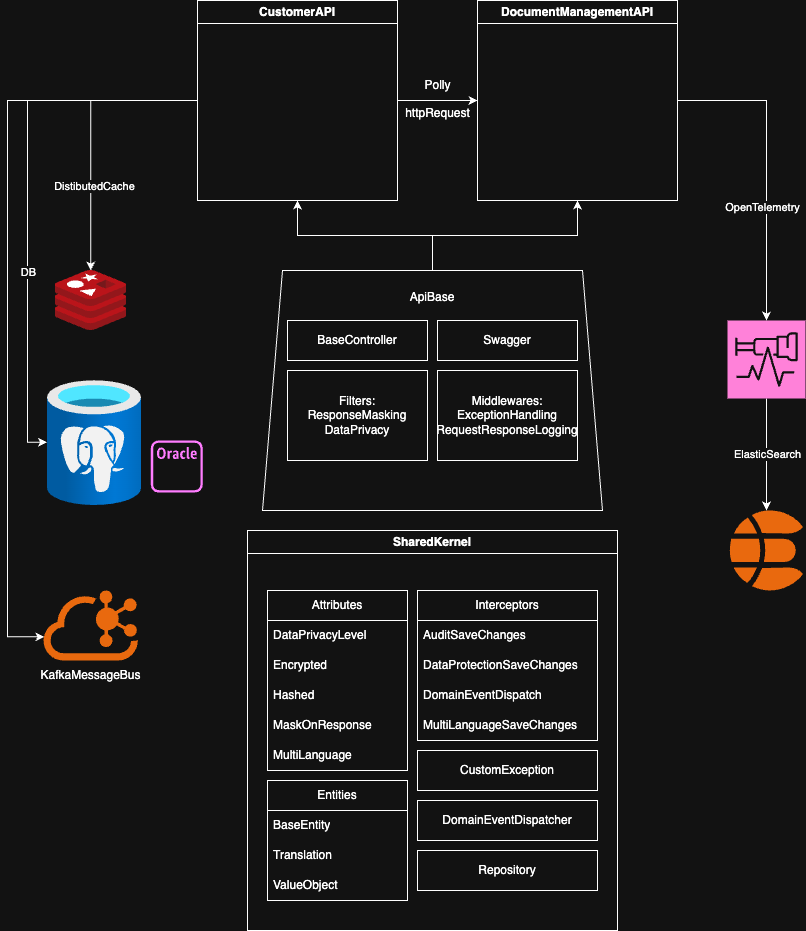

# ProjectNeoverse – Architecture Overview

This document provides a comprehensive architectural overview of the ProjectNeoverse solution. It covers the structure of core components, key infrastructure patterns, and design decisions used across services.

## System Architecture


---

##  Solution Structure

The solution is organized under the `src/` directory and includes the following projects:

- **Neoverse.SharedKernel**  
  Provides base entity types, domain event handling, interceptors (e.g., audit, multilingual, encryption), and repository abstractions.

- **Neoverse.ApiBase**  
  Provides shared middleware, exception handling, base API controllers, and OpenTelemetry instrumentation. Depends on `SharedKernel`.

- **Neoverse.Customers**  
  A microservice demonstrating DDD, PostgreSQL persistence, Redis caching, Kafka event streaming, and OpenTelemetry tracing.

- **Neoverse.DocumentManagement**  
  A sample microservice for handling documents. Uses the same infrastructure stack and conventions.

All projects target `.NET 9.0` and are referenced by the solution file `ProjectNeoverse.sln`.

---

##  Design Decisions

###  SharedKernel
- BaseEntity and ValueObject definitions
- SaveChanges interceptors:
  - `AuditSaveChangesInterceptor`
  - `MultiLanguageSaveChangesInterceptor`
  - `DataProtectionSaveChangesInterceptor`
  - `DomainEventDispatchInterceptor`
- Generic repository abstractions
- DomainEventDispatcher

###  ApiBase
- Base API controllers for CRUD operations
- Middleware for:
  - Request/response logging
  - Exception handling
  - Data masking
- OpenTelemetry tracing for ASP.NET Core and HttpClient

###  Microservices
- Each service (e.g. `Customers`, `DocumentManagement`) references both `SharedKernel` and `ApiBase`.
- Follows Domain-Driven Design (DDD) and Clean Architecture principles.
- Services communicate over HTTP using typed `HttpClient` wrappers with resilience policies via **Polly**.

---

##  Data Stores and Caching

### PostgreSQL
- Each service uses its own **dedicated PostgreSQL database** to enforce **bounded context** isolation.
- Entity Framework Core is the ORM.
- Infrastructure supports database provider switching via configuration.

### Redis Caching
- Deployed as a standalone service.
- Used for read-heavy data (e.g., in `Customers` service).
- Accessed via a distributed cache abstraction.

```json
{
  "Cache": {
    "Provider": "Redis",
    "ConnectionString": "localhost:6379"
  }
}
```

---

##  Data Privacy and Encryption

The `DataProtectionSaveChangesInterceptor`:

- Encrypts string properties marked with `[Encrypted]` using **AES** before storing in the database.
- Decrypts values upon entity materialization, so domain models always work with plain text.
- Encryption key is injected via config:

```json
{
  "Encryption": {
    "Key": "MySuperSecretKey"
  }
}
```

---

##  Multi-Language Support

- Attributes like `[MultiLanguage]` mark fields that should support localization.
- `MultiLanguageSaveChangesInterceptor` automatically manages saving and retrieving translations.
- All translations are stored in a central `Translations` table.
- Query helpers support fetching localized or full-language versions.

---

##  Event-Driven Communication (Kafka)

- Kafka is used for asynchronous messaging between services.
- Events are produced and consumed in a decoupled fashion.
- Integration uses `Confluent.Kafka` client.
- Domain events are dispatched post-commit via `DomainEventDispatchInterceptor`.

---

##  Observability & Monitoring

- **OpenTelemetry SDK** used for traces and logs.
- Instrumentation applied to ASP.NET Core pipeline and HTTP clients.
- Exported to an **OpenTelemetry Collector** container.

### Logs & Traces Pipeline:
```
Application → OpenTelemetry SDK → otel-collector → Elasticsearch → Kibana
```

---

##  Multi-Database Strategy

Although all services currently use PostgreSQL, the system is designed for flexibility:

- Each service can independently switch to **NoSQL**, **Time-Series DB**, or **Graph DB** as needed.
- This promotes **loose coupling** and **tech-fit per domain**.

To switch providers:
```json
{
  "Database": {
    "Provider": "SqlServer",
    "ConnectionStrings": {
      "SqlServer": "Server=localhost;Database=neoverse;User Id=sa;Password=Pass@word1;"
    }
  }
}
```

Use environment variables:
```
Database__Provider=SqlServer
ConnectionStrings__SqlServer=...
```

---

##  Running the Full Stack with Docker Compose

To start PostgreSQL, Redis, Kafka, Elasticsearch, and the OpenTelemetry Collector:

```bash
docker compose -f docker-compose.yml -f docker-compose.override.yml up -d --build
```

If `docker-compose.override.yml` is present, it will include the sample APIs as well.

---

##  Summary

ProjectNeoverse provides a robust microservice architecture template with:

- Clean layering via SharedKernel and ApiBase
- Independent, scalable services with PostgreSQL and Redis
- Kafka-based asynchronous communication
- OpenTelemetry-based distributed tracing and logging
- Built-in multi-language and encryption support

This skeleton serves as a solid foundation for building enterprise-grade distributed systems.